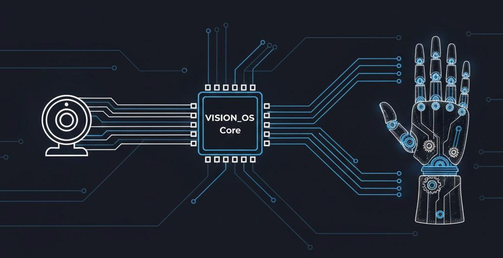

# VISION_OS - 用摄像头控制机械手

[English](README.md) | 简体中文

<p align="center">
  
</p>

用普通摄像头追踪手部动作，可选连接 WujiHand 机械手进行实时控制。

## Demo（真实硬件联动）

- 完整录像（下载/打开）：`docs/assets/demo1.mp4`


## Demo（网页界面/UI）

- 完整录像（下载/打开）：`docs/assets/demo2.mp4`


## 技术架构

```text
浏览器端 (MediaPipe + Three.js)
  - 手部追踪 + 计算五指伸展度(0-100)
  - UI / 遥测显示
        |
        | WebSocket（默认 ws://localhost:8765）
        v
Python Bridge（wuji_bridge.py）
  - 伸展度 -> 关节目标角映射
  - 安全：ARM、复位/解卡、watchdog
        |
        | USB（通过 wujihandpy）
        v
WujiHand 硬件
```

- **前端**：`index.html` + `app.js`（以及 `src/fingerExtension.js`）
- **后端桥接**：`wuji_bridge.py`（WebSocket 服务）
- **映射/配置**：`config/wuji_mapping.json`（可选覆盖）
- **文档**：`docs/TECHNICAL_DETAILS.md`、`docs/WUJI_INTEGRATION.md`

## 为什么做这个项目？

一开始是想做一个好看的手部追踪仪表板，赛博朋克风格那种。后来有了 WujiHand 机械手，就顺便加上了控制功能。做的过程中踩了不少坑，也做了一些优化，最终延迟大概在 ~50ms。

## 功能

**手部追踪（不需要机械手）**
- 双手追踪 + 手势识别（张开、剪刀、OK 等）
- 3D 可视化，赛博朋克风格

**机械手控制（需要硬件）**
- 5 指弯曲 + 拇指展开，~50ms 延迟
- USB 自动扫描，即插即用
- 安全机制：ARM 开关、Reset 序列、握力限制

## 硬件安全提示

本项目可以驱动真实硬件，**请自行承担风险**。使用时请远离运动部件（手指/头发/线材/异物），先用更保守的速度/电流参数测试，并随时准备断电/拔掉 USB。作者不对任何人身伤害或硬件损坏负责。

## 快速开始

```bash
# 装依赖
pip install -r requirements.txt
npm install

# 启动 Bridge（可选；会自动扫描设备）
python wuji_bridge.py --max-speed 2.0

# 启动前端
npm run dev:8080

# 打开 http://localhost:8080，点 ARM 开始控制
```

## 硬件（可选）

- 硬件控制依赖 **`wujihandpy`**（见 `requirements.txt`）。没有设备也可以正常运行仪表板/手部追踪。
- Windows 下可能需要用 Zadig 把设备驱动切到 **WinUSB**。详见 `docs/WUJI_INTEGRATION.md`。

## 项目结构

```
├── app.js, index.html     # 前端
├── wuji_bridge.py         # 后端 WebSocket + 硬件控制
├── config/                # 配置文件 (wuji_mapping.json)
├── src/                   # 前端模块
├── tools/                 # 调试工具（解卡、诊断等）
├── docs/                  # 文档
└── tests/                 # 测试
```

## 调试工具

```bash
python tools/unjam_now.py      # 解卡
python tools/goto_zero.py      # 回零位
python tools/wuji_diag.py      # 硬件诊断
```

## 文档

- `docs/PROJECT_SUMMARY.md` - 项目总结
- `docs/WUJI_INTEGRATION.md` - 集成指南
- `THIRD_PARTY_NOTICES.md` - 第三方依赖与授权说明

## License

MIT - 见 `LICENSE`。
